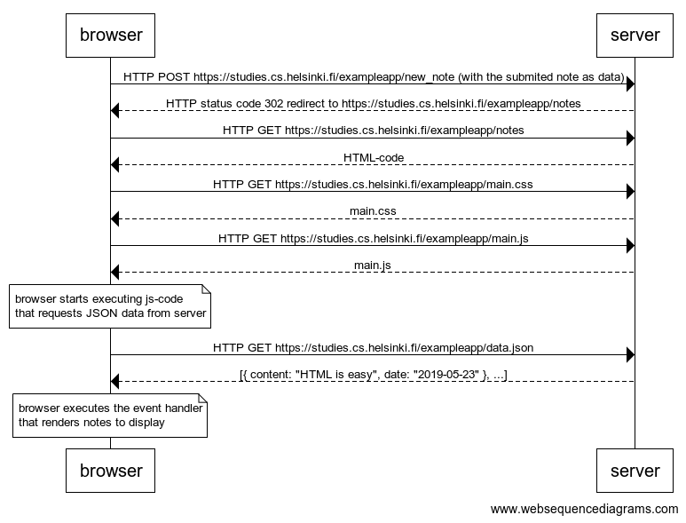
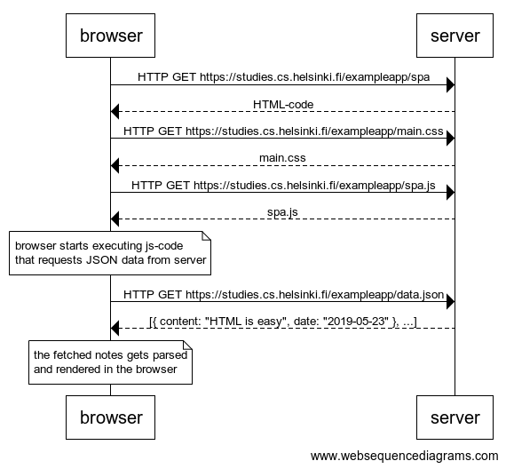
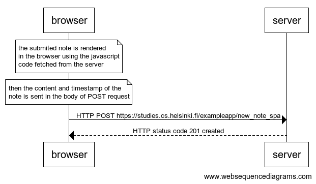

# Part 0

## 0.4 New Note
Create a diagram depicting the situation where the user creates a new note on page https://studies.cs.helsinki.fi/exampleapp/notes by writing something into the text field and clicking the submit button.

[Solution in txt](./assests/0.4_solution.txt) 

## 0.5 Single Page App
Create a diagram depicting the situation where the user goes to the single page app version of the notes app at https://studies.cs.helsinki.fi/exampleapp/spa

[Solution in txt](./assests/0.5_solution.txt)

## 0.6 New Note
Create a diagram depicting the situation where the user creates a new note using the single page version of the app.

[Solution in txt](./assests/0.6_solution.txt)

