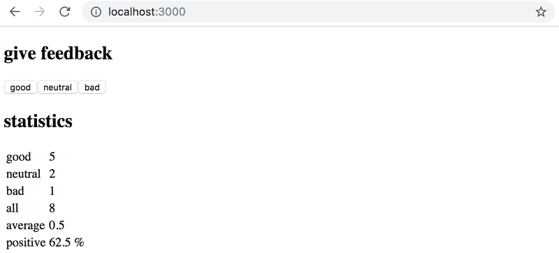

## 1.11*: unicafe step6

Display the statistics in an HTML [table](https://developer.mozilla.org/en-US/docs/Learn/HTML/Tables/Basics), so that your application looks roughly like this:

Remember to keep your console open at all times. If you see this warning in your console:

Then perform the necessary actions to make the warning disappear. Try Googling the error message if you get stuck.

*Typical source of an error `Unchecked runtime.lastError: Could not establish connection. Receiving end does not exist.` is Chrome extension. Try going to `chrome://extensions/` and try disabling them one by one and refreshing React app page; the error should eventually disappear.*

**Make sure that from now on you don't see any warnings in your console!**